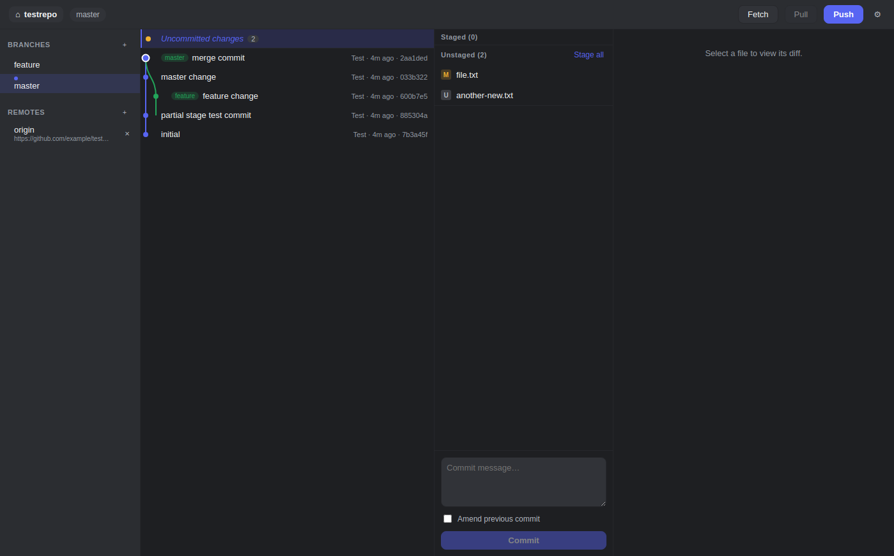
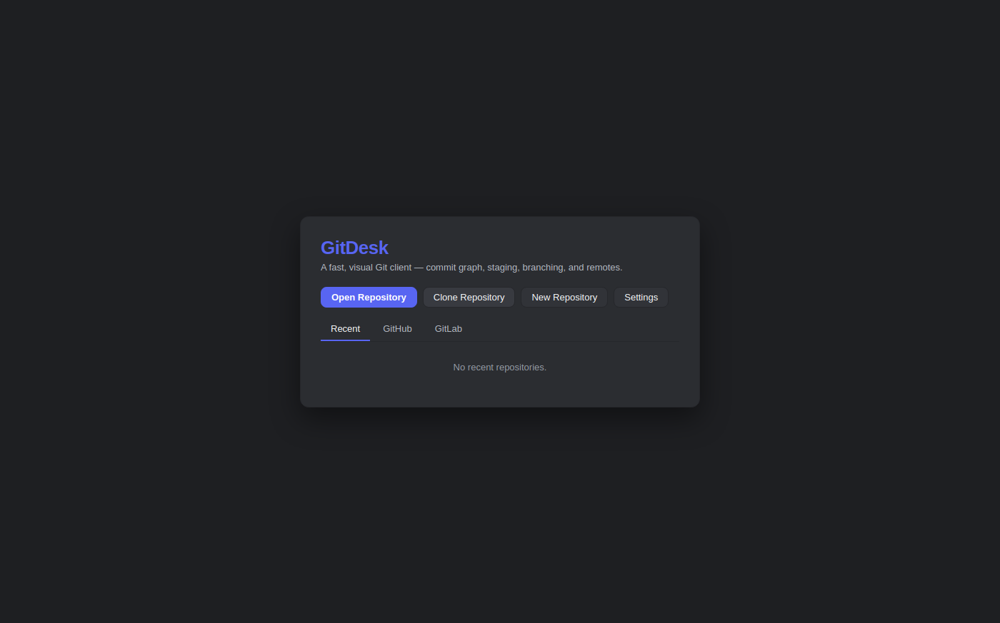
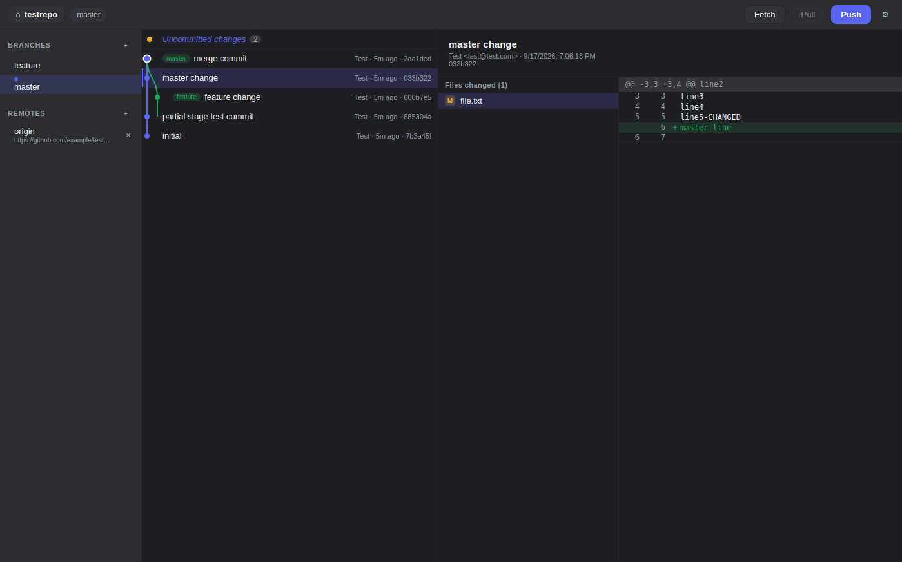
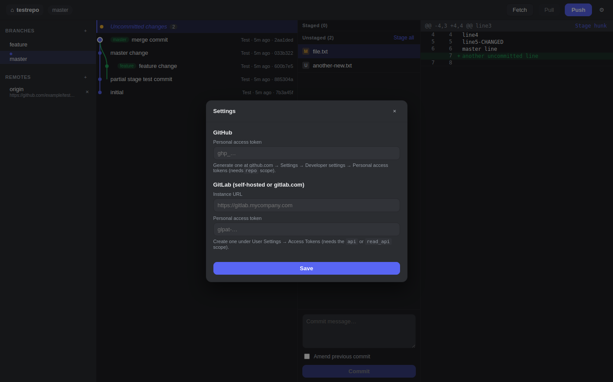

# GitDesk

A visual desktop Git client: a commit graph, staging and hunk-level diffing,
branch management, merge/rebase with conflict resolution, and repository
browsing for GitHub and self-hosted or hosted GitLab.

Built with Electron, React, and TypeScript. It shells out to the real `git`
CLI on your machine rather than bundling its own Git implementation, so it
behaves exactly like the git you already know.



<table>
<tr>
<td></td>
<td></td>
<td></td>
</tr>
</table>

## Features

- **Commit graph** — multi-lane branch/merge visualization with ref badges
  (branches, remote branches, tags, HEAD).
- **Staging & diffs** — stage/unstage whole files or individual hunks, discard
  changes, view unified diffs with add/remove highlighting.
- **Commit composer** — write a message and commit (with amend support).
- **Branches** — create, checkout, rename, delete, merge, and rebase from the
  sidebar.
- **Remotes** — fetch, pull, push (with upstream tracking and
  force-with-lease), add/remove remotes.
- **Stash** — save working changes (optionally including untracked files),
  view a stash's diff, apply, pop, or drop it from the sidebar.
- **Tags** — create lightweight or annotated tags on any commit, push them to
  a remote, or delete them locally and remotely from the sidebar.
- **Cherry-pick** — apply any commit onto the current branch from its detail
  view.
- **Interactive rebase** — reorder, reword, edit, drop, squash, or fixup a
  range of commits with a drag-free planner UI; pauses on conflicts just
  like a normal rebase.
- **Conflict resolution** — see conflicted files during a merge/rebase/
  cherry-pick/interactive rebase, take ours/theirs, or mark resolved
  manually; abort or continue the operation.
- **GitHub integration** — connect a personal access token to browse and
  clone your repositories.
- **GitLab integration** — connect any instance (gitlab.com or a self-hosted
  install) via URL + personal access token to browse and clone projects.
- **Native menu bar** — File/Edit/View/Window/Help with Open/Clone/New
  Repository, Preferences, and standard OS window/edit actions.

## Install

GitDesk ships as a native installer for macOS, Windows, and Linux. Grab the
latest one for your OS from the [**Releases**](../../releases) page, then
follow the steps below. You'll need `git` itself already installed and on
your `PATH` — GitDesk drives it, it doesn't replace it.

### macOS

1. Download `GitDesk-<version>.dmg` from Releases.
2. Open the `.dmg` and drag **GitDesk** into your **Applications** folder.
3. Since this build isn't signed with an Apple Developer certificate,
   Gatekeeper will refuse to open it the first time. Do **one** of:
   - Right-click (or Control-click) **GitDesk** in Applications → **Open** →
     confirm **Open** in the dialog. You only need to do this once.
   - Or run in Terminal: `xattr -cr /Applications/GitDesk.app`
4. Launch GitDesk from Applications or Spotlight from then on.

### Windows

1. Download `GitDesk-Setup-<version>.exe` from Releases (or the portable
   `GitDesk-<version>.exe` if you'd rather not install anything).
2. Run it. Windows SmartScreen may show "Windows protected your PC" because
   the installer isn't code-signed — click **More info** → **Run anyway**.
3. Follow the installer prompts. GitDesk will appear in your Start Menu.

### Linux

Download from Releases and pick the format that matches your system:

- **AppImage** (works on any distro):
  ```bash
  chmod +x GitDesk-<version>.AppImage
  ./GitDesk-<version>.AppImage
  ```
- **Debian/Ubuntu** (`.deb`):
  ```bash
  sudo apt install ./gitdesk_<version>_amd64.deb
  ```
- **Fedora/RHEL** (`.rpm`) or **Arch** (`.pacman`), if published: install with
  your distro's normal package tool (`sudo dnf install ./gitdesk-*.rpm`,
  `sudo pacman -U gitdesk-*.pacman`).

### Building it yourself instead

Prefer to build from source? Clone the repo and run the script for your OS —
it detects your distro/Windows version, installs Node.js and git if they're
missing, and produces the installer locally:

```bash
git clone https://github.com/jstanford314/gitdesk.git
cd gitdesk

./scripts/build-linux.sh        # Linux — outputs to release/
.\scripts\build-windows.ps1     # Windows (run from PowerShell)
npm run dist:mac                # macOS (must run on a Mac)
```

## Connecting GitHub / GitLab

Open **Settings** (gear icon) from the top bar or welcome screen:

- **GitHub**: paste a personal access token with `repo` scope
  (github.com → Settings → Developer settings → Personal access tokens).
- **GitLab**: enter your instance URL (e.g. `https://gitlab.example.com`) and
  a personal access token with `read_api`/`api` scope
  (User Settings → Access Tokens). Works with gitlab.com and self-hosted
  instances alike.

Tokens are stored locally, encrypted at rest via Electron's `safeStorage`
where available.

## Developing

```bash
npm install
npm run dev          # launch in development with hot reload
npm run typecheck    # type-check main/preload/renderer
npm run build         # type-checks and bundles main/preload/renderer
```

### Architecture

- `src/main` — Electron main process: git operations (via `child_process`
  calls to the `git` binary), GitHub/GitLab REST clients, settings
  persistence, and IPC handlers.
- `src/preload` — a narrow `contextBridge` API (`window.gitApi`) exposed to
  the renderer; no Node/Electron access leaks into the UI.
- `src/renderer` — the React UI: commit graph, sidebar, diff viewer, staging
  panel, settings, and repo picker, backed by a single Zustand store.
- `src/shared` — TypeScript types shared between main and renderer.

### Releasing a new version

Push a tag matching `v*` (e.g. `v0.2.0`) and
`.github/workflows/build-gitdesk.yml` builds installers for all three
platforms on GitHub's own runners and publishes them to a new GitHub
Release automatically. You can also trigger a build without releasing from
the Actions tab (`workflow_dispatch`).
